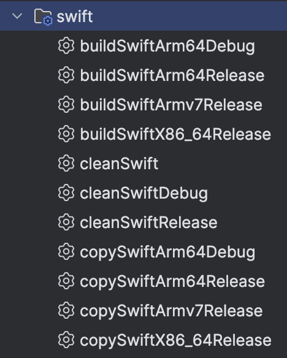
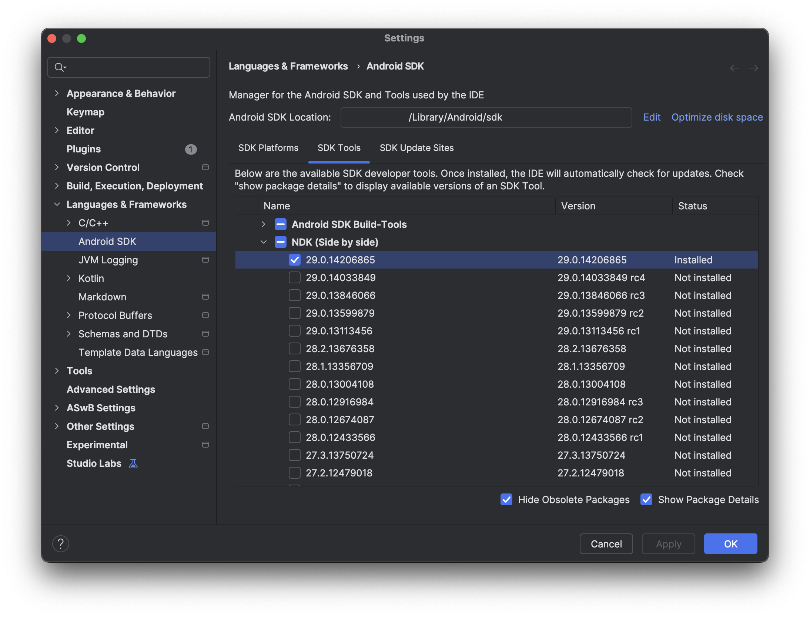

# Swift Android Gradle Plugin


## Plugin

The _Swift Android Gradle Plugin_ simplifies the integration of **Swift** libraries into **Android** projects. Building _Swift_ code for _Android_ requires a lot of boilerplate configuration and scripting. This plugin encapsulates all that complexity, providing a simple, opinionated way to build and integrate Swift libraries into your Android app.
See a [sample app](./sample).

> Swift SDK for Android is still in alpha: checkout the setup section below on the required toolchain.

```kotlin
plugins {
    // apply android app/lib plugin first

    id("com.charlesmuchene.swift-android-gradle-plugin") version "0.1.0-alpha"
}
```

### Configuration

After applying the plugin, the `swift` config block is available to configure your build. For example, we can set the `apiLevel` and the `abi`s when building a debuggable project.

```kotlin
swift {
    apiLevel = 35
    debugAbiFilters = setOf("arm64-v8a", "x86_64")
}
```

See `SAGPConfig` [file](plugin/src/main/java/com/charlesmuchene/plugin/SAGPConfig.kt) for all available configuration options.

### Architectures

The plugin supports building for 3 architectures:

- arm64-v8a
- armeabi-v7a
- x86_64

To add support for additional architectures, clone plugin and add these to [Arch](./plugin/src/main/java/com/charlesmuchene/plugin/utils/Arch.kt). The plugin can be update to receive a new supported architecture as a configuration.

### Tasks

The `Swift Android Gradle Plugin` registers and configures several tasks in the `swift` task group to aid in building the _Swift_ code for your project. These tasks are invoked implicitly when you assemble/clean the library or application.



## Setup

To use the plugin for your project, we need to install the required tools to _cross-compile_ Swift for Android:

> NOTE: Cross-compilation requires that the host toolchain version exactly matches the Swift SDK version.

To manage swift versions, we'll use `Swiftly` - a Swift toolchain installer. You can install it using [homebrew](https://formulae.brew.sh/formula/swiftly#default) or from [swift.org](https://www.swift.org/install/macos/swiftly/).

### 1. Toolchain

To match the Swift SDK Version, we'll use [dev snapshots](https://www.swift.org/install/macos/#development-snapshots). The current plugin version is tested against version `main-snapshot-2025-10-17`.

a. Download the host toolchain `swiftly install main-snapshot-2025-10-17`
b. Set it for use: `swiftly use main-snapshot-2025-10-17`

Verify the desired version is installed by running:

```shell
➜  swiftly run swift --version
Apple Swift version 6.3-dev (LLVM d8e7cc748ee6e7f, Swift a07ea37d0054945)
Target: arm64-apple-macosx15.0
Build config: +assertions
```

### 2. Swift SDK for Android

Install the `Swift SDK for Android` using the official instructions at [Swift SDK Bundles](https://www.swift.org/install/macos/#swift-sdk-buindles-dev). The site provides a handy functionality to copy the install command.

Verify the sdk is install by running:

```shell
➜ swift sdk list
swift-DEVELOPMENT-SNAPSHOT-2025-10-17-a-android-0.1
```

### 3. Installing the Android NDK

Use the _Android SDK manager_ to install the `Native Development Kit`. The manager installs the NDK in a subdirectory of your main Android SDK location: `ANDROID_SDK_HOME/ndk/ndk-version`. If you use the default location, _ANDROID_SDK_HOME_ should point to _~/Library/Android/sdk_. If not, check the location in Android Studio via _Tools > SDK Manager_.

Here's a screenshot showing sdk manager tool window with (one of the) installed NDK version highlighted.



With the NDK installed:

1. Set the environment variable `ANDROID_NDK_HOME` to the location of the desired NDK version.
   I have NDK version: `29.0.14206865` therefore I have set environment variable as: `export ANDROID_NDK_HOME=ANDROID_SDK_HOME/ndk/29.0.14206865`.

2. Link the NDK to the Swift SDK for Android by running the `setup-android-sdk.sh` utility script included with the Swift SDK bundle. Run the following command:

   ```shell
   ~/Library/org.swift.swiftpm/swift-sdks/swift-DEVELOPMENT-SNAPSHOT-2025-10-17-a-android-0.1.artifactbundle/swift-android/scripts/setup-android-sdk.sh
   ```

> For a comprehensive walkthrough on setting up Swift SDK for Android, checkout [this getting started article](https://www.swift.org/documentation/articles/swift-sdk-for-android-getting-started.html).

😮‍💨 And that's it. You can now use the `Swift Android Gradle Plugin` and write your native libs in Swift!

## Contact

For questions or support, reach out via [GitHub Issues](https://github.com/charlesmuchene/SwiftAndroidGradlePlugin/issues).

## Contributing

Contributions and suggestions are welcome! 🎉
